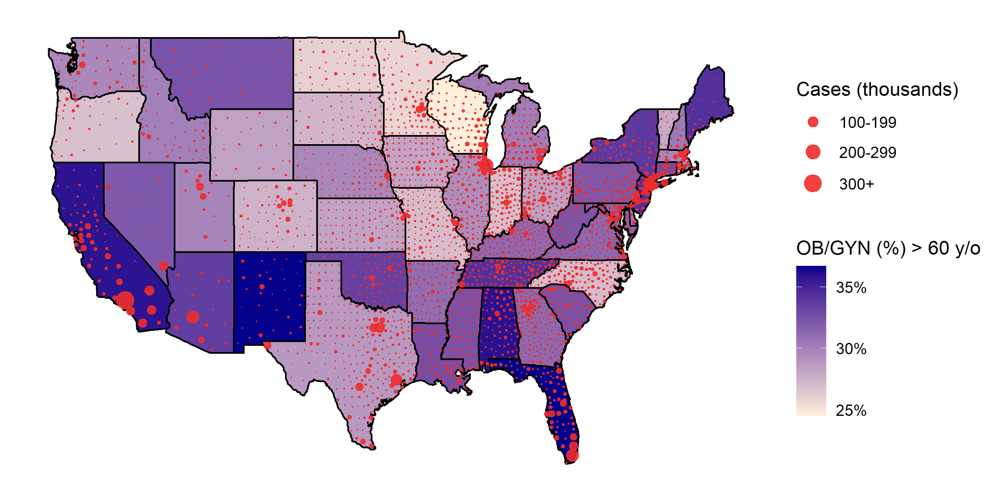

# Impact of the COVID-19 pandemic and OBGYN workforce distribution on vaccine deployment and predicting women's healthcare shortages

## Purpose

Obstetricians and gynecologists, who serve a vital role in providing women’s healthcare in the United States, are at risk of COVID-19 exposure via asymptomatic patients and deliveries. COVID-19 may lead to OB/GYNs, particularly those over the age of 60, to retire at an earlier rate. While the future impact is unknown, this loss of physicians can exacerbate pre-existing barriers in women’s access to healthcare. This study analyzes state-level geographical distribution of COVID-19 cases and age distribution of OB/GYNs to project which U.S. regions experience a more significant COVID-19 patient burden and provides a guide for vaccine distribution in the OB/GYN workforce.

## Visualization

 

## Data dictionary

* **generate.R:** R script to generate a U.S. bubble choropleth.
* **covid-confirmed.csv:** 
* **aamc-state-data.csv:** 
* **mega-table.csv:** 
* **state_births.csv:** 
* **state_sex.csv:** 
* **usa_lat_long.csv:** 

## Problems?

Please submit questions, comments, suggestions, and bug reports by opening an issue [here](https://github.com/rrrlw/covid-obgyn/issues).
