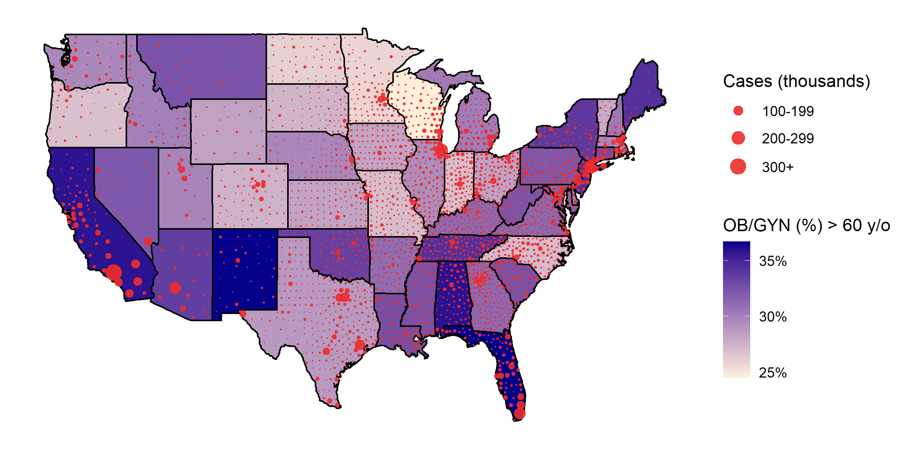

# Geographical impact of the COVID-19 pandemic on access to women’s health in the United States

## Purpose

Obstetricians and gynecologists (OB/GYNs) are at a high risk of contracting COVID-19 from patients, which can cause a shortage of OB/GYNs and increase barriers to accessing women's health care.
We identify which states in the U.S. are at risk of facing a shortage in OB/GYNs based on the geospatial heterogeneity in the spread of the COVID-19 pandemic and the age distribution of OB/GYNs across the United States.
Predicting areas at high risk of shortage of women's health care professionals can guide the way to targeted prevention policies.

## Visualization

 

States are shaded by proportion of OB/GYN physicians over 60 years of age (darker = more OB/GYNs > 60 yo).
Red bubble radius is proportional to the number of confirmed COVID-19 cases as of 21 June 2020.

## Data dictionary

* **generate.R:** R script to generate a U.S. bubble choropleth.
* **covid-confirmed.csv:** 
* **aamc-state-data.csv:** 
* **mega-table.csv:** 
* **state_births.csv:** 
* **state_sex.csv:** 
* **usa_lat_long.csv:** 

## Problems?

Please submit questions, comments, suggestions, and bug reports by opening an issue [here](https://github.com/rrrlw/covid-obgyn/issues).
